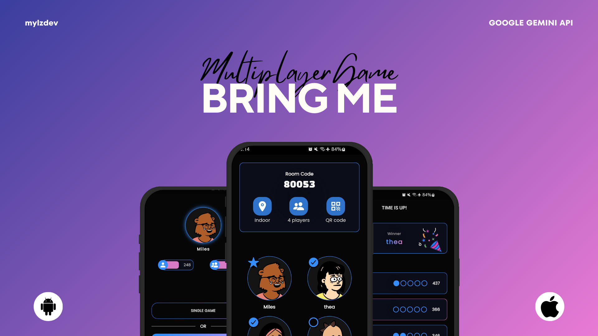

# Bring Me - Multiplayer Game

Bring Me is a mobile game where players are tasked with finding and bringing specific items to the host. The game features a dynamic and interactive environment driven by the Google Gemini API.

## 🎉 Minor Release! 🎉
We are excited to introduce the minor release of **Bring Me**, your new go-to game for fun and excitement! 

### What’s Inside:
- **Classic Gameplay**: Enjoy the thrill of the "Bring Me" game where you race against time to bring items to the host.
- **Avatar Selection**: Customize your in-game presence with unique avatars.
- **Single & Multiplayer Modes**: Challenge yourself in single-player mode or compete with friends in multiplayer.
- **Leaderboards**: Climb the ranks with daily, weekly, and monthly leaderboards. (Soon)
- **Room Codes & QR Scanning**: Join or create rooms easily using codes or QR scanning.

More features and fun are on the way! 

## Installation

- [**arm64-v8a.apk**](https://github.com/mylzdev/bring-me/releases/download/v1.0.0/app-arm64-v8a-release.apk) : For modern and newest versions.
- [**armeabi-v7a.apk**](https://github.com/mylzdev/bring-me/releases/download/v1.0.0/app-armeabi-v7a-release.apk) : For older versions.
- [**x86_64.apk**](https://github.com/mylzdev/bring-me/releases/download/v1.0.0/app-x86_64-release.apk) : For devices with Intel processors.

**Not Sure Which APK to Install?** 

Download the [**BRING ME**](https://github.com/mylzdev/bring-me/releases/download/v1.0.0/bring-me.apk) fat apk which includes support for all architectures.

#### Note: iOS version will be up soon

## License

Bring Me is released under the [MIT-License](LICENSE). Feel free to use, modify, and distribute it as you wish. 

## Acknowledgments

Special thanks to [Flutter](https://flutter.dev/) and [Dart](https://dart.dev/) teams for creating such amazing tools. 

We hope you enjoy using Moodlet and find it helpful in tracking and understanding your emotional journey!

## Support

If you like this project you can [buy me a coffee](https://buymeacoffee.com/bsemcmoralf).

